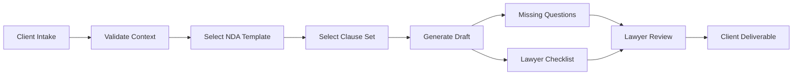
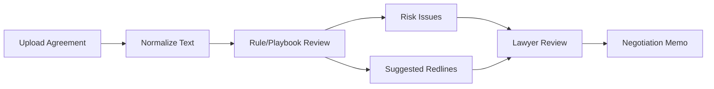

# Architecture

## Core Principle

The product is not a chatbot. It is a controlled legal workflow with lawyer review.

The agent can:

- collect context,
- choose templates,
- assemble clauses,
- flag risks,
- suggest redlines,
- produce summaries.

The lawyer must:

- verify facts,
- decide legal strategy,
- approve final language,
- own the final advice.

## Workflows

### Draft From Scratch

### Review Existing Agreement

## Recommended Next Product Modules

- DOCX ingestion and export.
- Clause playbook editor controlled by lawyer users.
- Redline generation in Word format.
- Client portal with matter intake.
- Matter/audit database.
- Human approval queue.
- LLM provider adapter.
- Eval set using previously reviewed NDAs.
